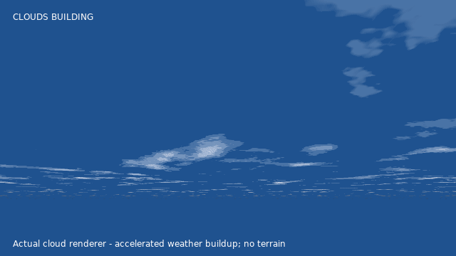
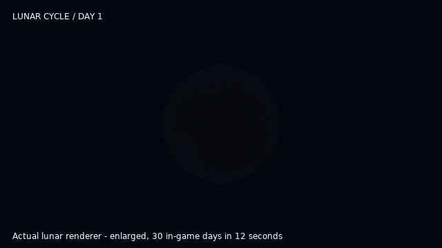
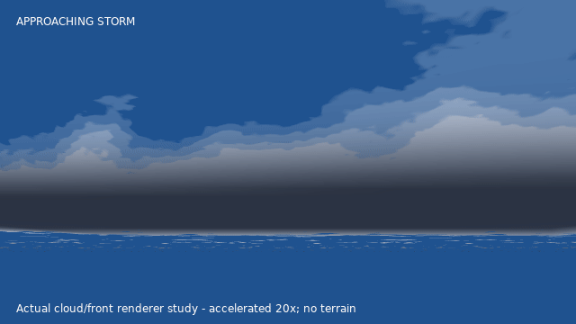

# Lightweight Weather & Skies

Moving clouds, changing weather, and a sky worth stopping to look at. Storms travel across the map; the sky shifts through day and night; rain, snow, lightning, auroras and meteors give you reasons to look up.

**Release status:** 1.1.0 updates lightning on the established Gen 1 track. Its source tests and isolated GPU previews pass; the updated lightning has not had a fresh full-game or headset performance pass. Gen 2 remains beta, and non-VR Android remains alpha. See [compatibility and known limits](#compatibility-and-release-status) before installing.

Built for **Battle Art on Gen1Recomp**, with Gen2Recomp support in beta. One LWS ZIP routes to PC, standalone Quest, or alpha non-VR Android as appropriate; Battle Art and the Quest bridge are separate installs.

## What it adds

- Clouds that drift, slowly morph, and thicken before storms.
- Moving storms, rain, snow, wind, lightning and delayed thunder.
- Day/night colors, stars, a lunar cycle, auroras and meteor showers.
- Regional weather, gradual storm clearing and occasional rainbows.
- Varied nature ambience and rare, location-appropriate Pokémon cries.

The cloud image above is real Quest development footage. World models and other mods shown are not included.

*Actual cloud renderer in an isolated accelerated preview. This demonstrates formation and breakup, not headset gameplay or performance.*

## A sky that changes as you play

### Day and night

The sky moves through warm dawn, morning, blue daytime, late-afternoon warmth, sunset and deep-blue night. Colors blend between times instead of switching in hard bands. The sun and moon change position with the clock, while the clouds pick up warmer sunlight or cooler nighttime colors.

Use the main **DAYTIME** control to let the clock run or hold a particular time for exploring and screenshots. The tested host setup includes morning, late afternoon and dusk choices as well as day and night; the exact choices and cycle speed come from your host/bridge. A pinned NIGHT is useful for previews, but it is not the same as letting days pass naturally.

For the full experience, use a running clock such as **CYCLE**, **WEATHER → AUTO**, and **LITE WEATHER FX → REGIONAL WEATHER → ON**. You do not need to manually trigger every event.

### Northern lights

Aurora is one evolving sky effect built from **two moving curtain layers**, not a collection of separate sky textures. Its **three special flourishes** are a curtain that splits and reconnects, rose-pink fringes, and an overhead crown. The normal curtains also develop brighter moving bands. Green and teal glow along the lower folds while violet and rose drift through the higher folds; the colors and shapes change gradually instead of playing one fixed animation.

The display has a saved, world-anchored direction, so turning your head does not drag it around. Most natural displays appear toward the north; occasional ones take a different bearing, and any outdoor region can see them at night. The chosen night and bearing vary between saved 15-day blocks. Within a display, slow waves and moving light packets keep the folds from looking identical from one moment to the next. The spicy showcase brings the three flourishes forward sooner; it does not create a different natural aurora frequency.

Natural aurora nights are picked from each **15-day block** of the saved in-game day counter. That means a randomly chosen night, not a guarantee every fifteenth night or a new roll each time you enter a map. You still need to be outdoors at night with the clock advancing to catch one.

*Real Quest development footage. This is a showcase, not a promise that every natural aurora reaches the same intensity.*

Want to see one now? Set **DAYTIME → NIGHT**, go outdoors, and open **LITE WEATHER FX → SHOWCASE CONTROLS** for the aurora preview. The spicy option brings out the bigger flourishes for clips 🌶️. Close all menus after triggering it. Showcase controls do not make natural auroras permanently more common.

### The lunar cycle

The moon has a **30-in-game-day cycle**: new moon, waxing phases, full moon, waning phases, then back to new. Its cratered surface stays the same while the illuminated portion changes. A new moon can be very faint; a full moon is the easiest phase to spot.

The phase follows the saved natural-day counter—not 30 real-world days. Holding the time on NIGHT does not advance a whole lunar month. **LITE WEATHER FX → LUNAR CYCLE** shows the current day; **SHOWCASE CONTROLS → MOON PHASE PREVIEW** lets you try waxing, full, waning, crescent and new phases, then return to NATURAL. Previewing a phase does not rewrite the natural day count.

*Actual lunar texture and phase renderer, enlarged for visibility. Thirty in-game days are compressed into this 12-second preview; this is not gameplay footage or the moon's normal screen size.*

### Regional weather

Kanto and beta Johto do not use identical weather odds everywhere. With **WEATHER → AUTO** and **REGIONAL WEATHER → ON**, each outdoor area has a **climate profile**—a weather biome that weights clear skies, rain, storms and wind, and can change a front's size, speed or duration. This changes the sky and weather, not the terrain or Pokémon encounters. These are tendencies, not guaranteed forecasts or instant weather changes at a town border. Nearby maps share larger weather regions, and fronts can carry a spell toward neighboring regions instead of rerolling the whole sky on every boundary.

Kanto examples:

| Area | Weather personality |
| --- | --- |
| Pallet and Route 1 | More clear spells, fewer storms. |
| Viridian and Route 2 | Rain-favoring woodland weather. |
| Viridian Forest | Its own wetter forest climate, persisted separately from Route 2. |
| Pewter and Routes 3–4 | Breezier foothills, with shorter wet spells. |
| Vermilion and nearby coastal routes | Windier, stormier weather and quicker-moving fronts. |
| Celadon and Saffron | A calmer, clearer central-Kanto balance. |
| Lavender and the eastern coast | More rain and longer wet spells. |
| Fuchsia and the lowland routes | Wetter conditions and slower, longer-lasting storms. |
| Safari Zone outdoor areas | A shared savannah climate: sunnier and windier, with faster lightning during storms. |
| Cinnabar and the southern sea routes | Windier island weather with stronger storm tendencies. |

Gen 2 beta adds Johto climate profiles too:

| Area | Weather personality |
| --- | --- |
| New Bark and Cherrygrove side | More clear spells and gentler storms. |
| Ilex Forest and Azalea side | Wetter, slower-moving woodland weather. |
| Violet, Goldenrod, Ecruteak and National Park | A comparatively balanced plains/central mix. |
| Olivine, Cianwood and western sea routes | Windier coast with faster, stronger storm fronts. |
| Mahogany and Lake of Rage | Wetter lake country with longer rain and more storm tendency. |
| Blackthorn, Mt. Silver and highland routes | Breezier highland fronts. |

Viridian Forest and the outdoor Safari Zone are deliberately their own persisted weather regions rather than copies of neighboring Route 2 or Fuchsia. The Safari's sunnier, windier savannah also runs storm lightning faster. Johto behavior is still beta and needs the same on-device verification noted below.

There is also a special combination to watch for around **Pewter and the outdoor Mt. Moon approaches on Routes 3–4**: a natural aurora night can bring light snow with partly cloudy skies. It needs AUTO weather and regional weather enabled; it does not make snow fall inside the cave.

Turning regional weather off removes these local preferences. Manually choosing rain, snow or another weather is still useful when you want a particular scene rather than the natural selection.

## Storms that roll in

Storms form, travel through connected outdoor maps, and eventually dissipate. Ahead of a storm, wind and haze can build; clouds grow denser before the remaining gaps close into overcast. Lightning can glow inside distant clouds, with quieter delayed thunder. The storm is not meant to restart from scratch at every route boundary.

*Actual moving-front simulation and cloud renderer, accelerated 20× in an isolated scene. The background is a simple preview backdrop; terrain, rain, thunder and distant lightning are not shown here. This is a cloud-approach demonstration, not headset gameplay footage.*

To record your own: go outdoors, face the horizon you want, then select **LITE WEATHER FX → SHOWCASE CONTROLS → APPROACHING STORM**. This selects STORM and MOVING automatically. Close all menus and give the front time to reach you. It leaves STORM selected afterward; return WEATHER to AUTO when you want natural weather again.

As rain clears, precipitation tapers, clouds break up and daylight returns. A faint rainbow can occasionally appear when the sun is low enough. **RAIN CLEARING TEST** previews that recovery while it is raining; it leaves WEATHER on CLEAR.

## Lightning

Flashing-light warning. There are **three visible lightning styles**: forked sky-to-ground strikes, anvil crawlers that spread across the cloud underside, and rolling light that travels through the cloud deck. A **fourth, distant-cloud style** lights the horizon without drawing a close bolt. All four families have **20 shape/timing profiles each (80 total)**, varying branching, sweep, width, glow spread and flash dispersion. These are variations within four styles, not 80 separate effects.

Each family shuffles twenty profiles without an immediate cycle-boundary repeat or identical consecutive cycle order. Individual events also vary their paths and placement. Anvil crawlers have longer, thinner winding channels with three to five branches and secondary forks growing from their junctions. Half the ground-strike profiles have clearer descending forks; the others retain subtle branching. Natural storms are more active, ground strikes are the majority of nearby events, and **FULL** has stronger storm illumination. **SOFT** retains gentle brightness and timing, and **OFF** disables lightning. Each event uses one static stereo-shared mesh, capped at 1,944 anvil or 864 ground vertices. Larger screen coverage and increased activity are not free; no zero-cost or headset FPS claim is made.

Expand a preview to play its GIF. The anvil and ground previews were captured from 1.1.0 at normal speed and natural FULL brightness using the actual lightning/cloud renderer in an isolated scene—not headset gameplay footage. The rolling preview is retained from 1.0. Each shows an example, not every profile.

Forked lightning

Anvil crawlers

Rolling cloud lightning

## Install and use

Back up your save, import the LWS ZIP through the mod manager, enable it, and restart. Update by replacing the older LWS package; do not keep two LWS versions or another weather system enabled at the same time. To roll back, disable/remove this ZIP and restore your previous version.

The LWS download is one ZIP, but Battle Art and the Quest bridge remain separate host dependencies—they are not bundled into LWS. Do not use a private Gen 2 Lab APK as the public mod download.

### Compatibility and release status

Platform acceptance statements below describe the 1.0 baseline. The 1.1.0
lightning changes have source tests and isolated desktop GPU checks, not a
fresh full-game or headset performance pass. Gen 3 is not supported by this ZIP.

| Game and platform | Required host pieces | Status |
| --- | --- | --- |
| Gen 1 on Windows / PC | Battle Art 1.10.9 or later includes the merged [companion-integrity fix (PR #57)](https://github.com/absol89/DramaticShapeVoxelMod/pull/57) | Tested by the owner on Gen1Recomp 0.2.24 with Battle Art 1.11.0: moving clouds, stars, sun and rain modes passed. Broader performance is not claimed; unfixed stock 1.10.8 is not claimed. |
| Gen 1 on standalone Quest | Compatible Battle Art plus `BATTLE_ART_QUEST_COMPAT` | Main 1.0 track. The owner accepted the private RC Lab visual and audio checks. The final cloud-spacing adjustment was tested on PC, not separately viewed on Quest; the public ZIP is a separate artifact. |
| Gen 2 on standalone Quest | Compatible Gen 2 Battle Art plus its Quest bridge | Beta. Clouds and general weather were reported working in private Lab 34; weather and lightning need more on-device feedback. Gen 2 performance was not measured for this release. |
| Android phone/tablet, non-VR | Compatible Battle Art with the companion-integrity fix | Alpha. Earlier S24 testing uncovered compatibility issues; report device/version and a clip if something does not render. |

Quest routing activates only when the standalone bridge is detected. Android by itself does not select the Quest path. PCVR and unrelated renderers are not claimed.

An earlier combined build was reported to show clouds without weather and to slow dialogue/map entry through the Poké Ball throw. The owner reports those checks passed on the latest private Gen 1 Quest Lab; the latest PC rain comparison also passed. These checks do not establish Gen 2 or Android performance. Please report a recurrence with a before/after clip. Permission for a light Quest derivative was supplied in conversation; the project has no blanket license for upstream material.

The main options page keeps **WEATHER**, **DAYTIME**, and **LIGHTNING** (FULL/SOFT/OFF) within easy reach. Open **LITE WEATHER FX** for storm pace/motion, constellations, regional weather, nature ambience, local cries and lunar information.

**LITE WEATHER FX → SHOWCASE CONTROLS** holds the storm, lightning, aurora, meteor and lunar previews. They are opt-in; ordinary CALM/RARE/ACTIVE lightning pace remains in the regular weather options. **LIGHTNING: MAKE IT SPICY** is a two-minute verification mode with forward-facing forked strikes and anvil crawlers about every six seconds. Close every menu and keep looking forward. FULL shows the sharp bolts; SOFT suppresses them. The showcase does not change the natural event schedule. Some previews intentionally select STORM, CLEAR or light snow; switch WEATHER back to AUTO afterward to resume natural weather.

If weather options or the Showcase tab are missing, report your platform, LWS and Battle Art versions, whether the Quest bridge is installed, and your mod list. Include a short clip. A missing Showcase tab is an LWS/menu-load problem; installing the Android layer on PC is not the fix.

“Lightweight” is the design goal, not a zero-performance-cost promise. Dialogue, map-entry, or area-transition slowdown should be reported separately from visual correctness, with the same mod list and a before/after clip.

## Optional cries

For an optional cry pack, see [Stadium Cries by Lockerz102](https://github.com/Lockerz102/Stadium-Cries/releases) and follow its own installation instructions and credits. The linked release currently lists Stadium/game-era packs; do not assume it includes the separately supplied Dynamic Cries anime pack.

No anime clips are bundled here. Local calls use the same-species engine cry fallback when an anime clip is unavailable. The recommendation is not a promise of automatic pack import or verified integration with every cry pack.

## Credits and release status

Derived from [The World](https://github.com/MrKrisSatan/The_World), with thanks to MrKrisSatan, THCrazy and Bo. The project owner reports permission to make this light-performance derivative, initially for Quest and intended for broader compatibility. This is not an upstream release or a blanket license over third-party material.

See [third-party notices](THIRD_PARTY_NOTICES.md), [weather-audio credits](assets/sounds/WEATHER_AUDIO_CREDITS.md), [nature-audio credits](assets/sounds/nature/SOUND_CREDITS.md), and the retained [MIT notice](lib/voxel_atmos/NOTICE.md). Technical compatibility identifiers are kept for existing saves and host integration.

Weather audio rotates between multiple rain, wind and thunder recordings to make loops less noticeable. Automated playback checks passed, and the owner accepted the latest Gen 1 Quest thunder pass. Experimental cloud shadows are not included.

See the [GitHub releases](https://github.com/HimioneGranger/Lightweight-Weather-and-Skies/releases) for current notes. Source permission and individual recording licenses are not interchangeable.
