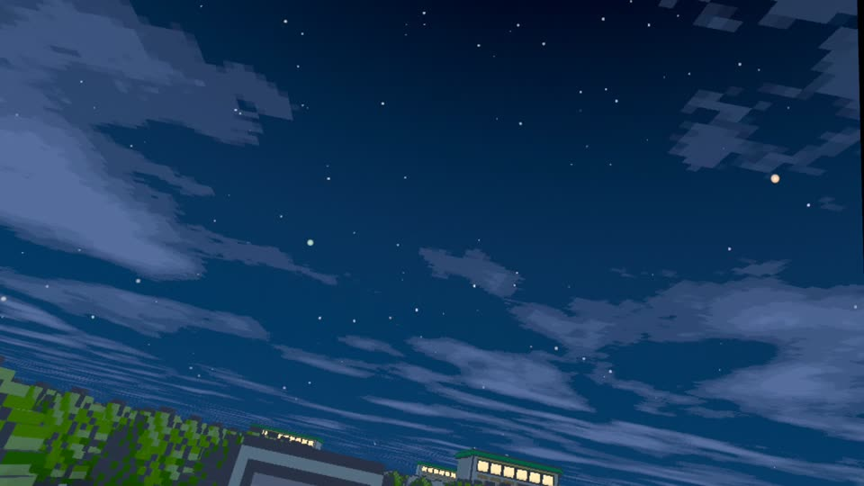
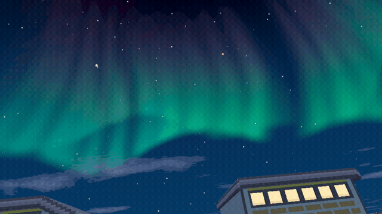
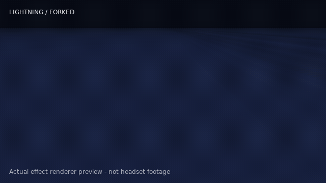
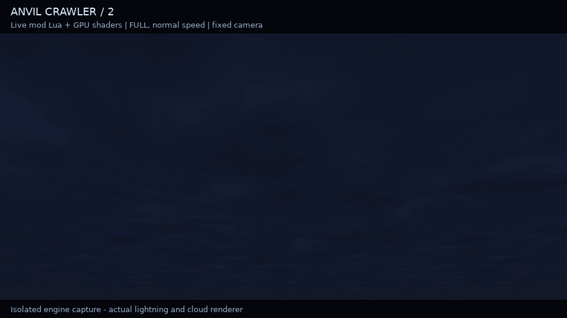
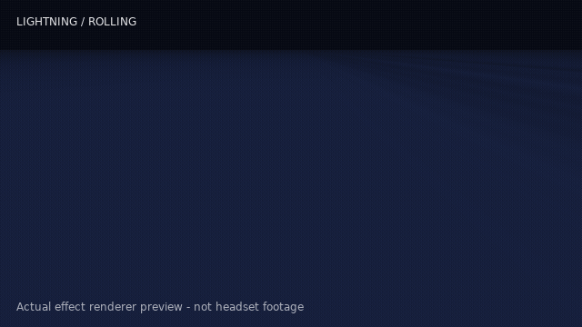

# Lightweight Weather & Skies

Moving clouds, changing weather, and a sky worth stopping to look at.

Works with **Battle Art on Gen1Recomp** today. More compatibility is planned.

## What it adds

- Clouds that drift, slowly morph, and thicken before storms.
- Moving storms, rain, snow, wind, lightning and delayed thunder.
- Day/night colors, stars, a lunar cycle, auroras and meteor showers.
- Regional weather, gradual storm clearing and occasional rainbows.
- Varied nature ambience and rare, location-appropriate Pokémon cries.

The cloud image and aurora GIF are real Quest development footage. World models and other mods shown are not included.

## Lightning

Flashing-light warning. Expand a preview to play its GIF. These use the mod's actual lightning and cloud renderer in an isolated scene—not headset gameplay footage. Each shows one example; storms vary their shapes and timing.

Forked lightning

Anvil crawlers

Rolling cloud lightning

## Install and use

Use the ZIP from this project's release handoff with a compatible Battle Art / Gen1Recomp build. Import it through the mod manager, enable it, and restart. Back up your save first. Do not run a second weather system alongside it.

One package contains the PC and standalone Quest adapters. Quest routing activates only when the standalone bridge is detected; an Android device alone does not qualify. The host game and compatibility bridge are **not included**. Tested integration: `BATTLE_ART_VOXEL_FORK` with the atmosphere companion API and `BATTLE_ART_QUEST_COMPAT`; a stock or differently versioned host is not automatically supported. PCVR and other renderers are not claimed yet.

Use **WEATHER** and **DAYTIME** for normal controls. **SHOWCASE CONTROLS** holds the storm, lightning, aurora, meteor and lunar previews—including **MAKE IT SPICY** for recording clips. Natural event frequency stays separate. Lightning also has SOFT/OFF controls.

The desktop compatibility layer needs the latest upward-look fix to view the midnight moon overhead. This is included in our tested PC setup, not in this weather-only ZIP.

“Lightweight” is the design goal, not a zero-performance-cost promise. PC and Quest smoke tests passed; results still depend on the host, hardware and other mods.

## Optional anime cries

We recommend [Dynamic Cries by Lockerz102](https://github.com/Lockerz102/Stadium-Cries/releases). The release includes `Dynamic_Cries_v1.4.3.zip`, with anime and game-era packs. Follow its installation instructions and credits.

No anime clips are bundled here. Local calls use the same-species engine cry fallback. The recommendation is not a promise of automatic pack import or a separately verified integration with every cry pack.

## Credits and release status

Derived from [The World](https://github.com/MrKrisSatan/The_World), with thanks to MrKrisSatan, THCrazy and Bo. The project owner reports permission to make this light-performance derivative, initially for Quest and intended for broader compatibility. This is not an upstream release or a blanket license over third-party material.

See [third-party notices](THIRD_PARTY_NOTICES.md), [weather-audio credits](assets/sounds/WEATHER_AUDIO_CREDITS.md), [nature-audio credits](assets/sounds/nature/SOUND_CREDITS.md), and the retained [MIT notice](lib/voxel_atmos/NOTICE.md). Technical compatibility identifiers are kept for existing saves and host integration.

Weather audio now rotates between five rain beds, three synthesized wind beds and eight thunder excerpts, with shuffled selection and crossfades. The new audio passed automated playback and decoding checks; it has not had a fresh on-headset listening or performance test. Experimental cloud shadows are not included.

This repository is private release preparation. See [release status](release-review/STATUS.md) before making it public; source permission and individual recording licenses are not interchangeable.
